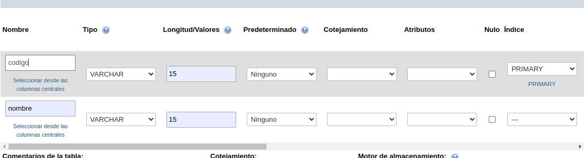
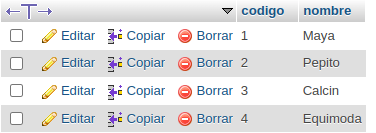
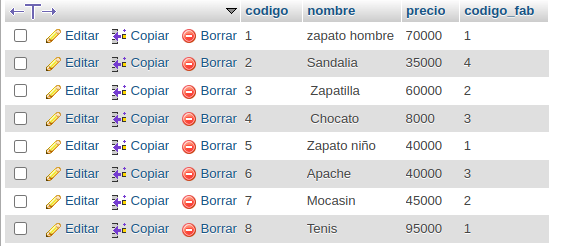
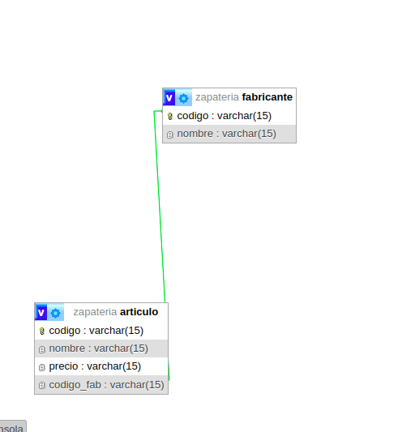

# BD_Zapateria

## Creacion tabla fabricante

## Creacion tabla Articulo

## Relación uno a muchos

# Consultas BD Zapatería

## 1. Obtener los nombres de los productos de la Zapateria

## 2. Obtener los nombres y los precios de los productos de la Zapatería.

## 3. Obtener el nombre de los productos cuyo precio sea menor o igual a 50000

## 4.Obtener todos los datos de los artículos cuyo precio esté entre 5000 y 40000 (ambas canditades incluidas)

## 5.Obtener el nombre y el precio de cada artículo, en dolares.

## 6. Obtener el precio promedio de todos los artículos

## 7.Obtener el precio medio de los artículos cuyo codigo de fabricante sea 2.

## 8.Obtener el número de artículos cuyo precio sea mayor o igual a 50000

## 9. Obtener el nombre y precio de los artículos cuyo precio sea mayor o igual a 50000 y ordenarlos descendentemente por precio, y luego ascendentemente por nombre.

## 10.Obtener un listado completo de artículos, incluyendo por cada articulo los datos del artículo y de su fabricante.

## 11.Obtener un listado de articulos, incluyendo el nombre del articulo, su precio y el nombre de su fabricante.

## 12. Obtener el precio medio de los productos  de cada frabricante, mostrando solo los codigos de fabricante.

## 13. Obtener el precio medio de los productos de cada fabricante, mostrando el nombre del fabricante.

## 14. Obtener el nombre de los fabricantes que ofrezcan productos cuyo precio medio sea mayor o igual a 50000

## 15. Obtener el nombre y el precio del artículo mas barato.
